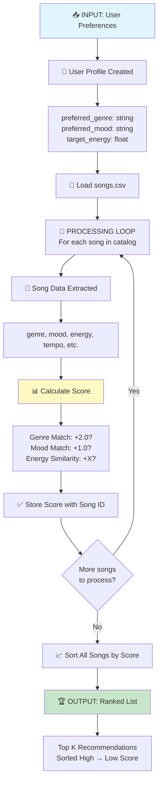
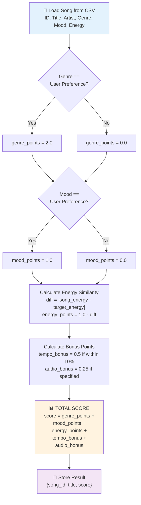
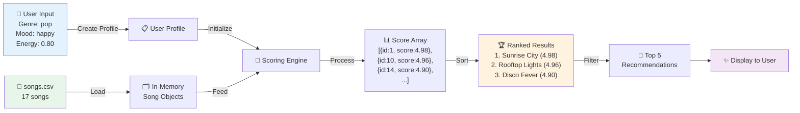

# Music Recommender - Scoring Logic Design

## Algorithm Recipe Overview
This document defines the specific rules and point-weighting strategy used to recommend songs based on user preferences.

---

## Point-Weighting Strategy

### 1. **Genre Match** - 2.0 points
- **Rationale**: Genre is a primary categorization that reflects fundamental musical style. Songs in the same genre share instrumental characteristics, production style, and audience expectations.
- **Implementation**: If user's preferred genre matches song's genre exactly → +2.0 points
- **Data Insight**: Our catalog has diverse genres (pop, lofi, rock, ambient, synthwave, jazz, country, grime, disco, reggae, orchestral, breakbeat) with varying audio characteristics.

### 2. **Mood Match** - 1.0 point
- **Rationale**: Mood is a secondary but important factor that captures the emotional resonance. Multiple genres can share moods (e.g., "chill" appears in lofi, ambient, and jazz).
- **Implementation**: If user's mood preference matches song's mood exactly → +1.0 point
- **Data Insight**: Moods in catalog: happy, chill, intense, relaxed, focused, moody
- **Note**: A song can have both genre AND mood match simultaneously.

### 3. **Energy Level Similarity** - Up to 1.0 point (scaled by proximity)
- **Rationale**: Energy level (0.0-1.0 scale) is a continuous variable that directly impacts how the song "feels" during listening. Closer energy matches provide better recommendations.
- **Implementation**: 
  - Calculate absolute difference: |user_energy_target - song_energy|
  - Score = 1.0 - (energy_difference / 1.0)
  - If difference ≤ 0.15 → Full 1.0 point (high similarity)
  - If difference = 0.5 → 0.5 points (moderate similarity)
  - If difference > 0.8 → Near 0 points (poor similarity)
- **Data Insight**: Energy ranges from 0.28 (Spacewalk Thoughts - ambient) to 0.93 (Gym Hero - pop/intense)
- **Example**: If user wants energy=0.75, Neon Echo's "Night Drive Loop" (0.75 energy) scores 1.0, while Spacewalk Thoughts (0.28) scores ~0.0

### 4. **Bonus Factors** (Optional enhancements)
- **Tempo Alignment** - 0.5 points (if within 10% of user preference)
  - Data range: 60-152 BPM
  - Helps refine recommendations when primary factors are equal

- **Audio Feature Alignment** (Danceability, Acousticness, Valence)
  - Can be used as tiebreakers
  - 0.25 points per feature if user specifies preference
  - Example: User wants "upbeat and danceable" → prioritize high danceability (0.79-0.94 range)

---

## Recommendation Score Formula

```
FINAL_SCORE = 
    (genre_match × 2.0) +
    (mood_match × 1.0) +
    (energy_similarity × 1.0) +
    (tempo_bonus × 0.5) +
    (audio_features_bonus × 0.25)

Max possible score: 5.0 points (rarely achieved, realistic max ~4.0)
```

---

## Scoring Logic Examples from Dataset

### Example 1: User Profile
- Preferred Genre: **pop**
- Preferred Mood: **happy**
- Target Energy: **0.80**

**Top Recommendations:**
1. "Sunrise City" (ID: 1) - Neon Echo
   - Genre match: +2.0 ✓
   - Mood match (happy): +1.0 ✓
   - Energy (0.82): +0.98 ✓
   - **TOTAL: 4.98**

2. "Rooftop Lights" (ID: 10) - Indigo Parade
   - Genre match (indie pop): +2.0 ✓
   - Mood match (happy): +1.0 ✓
   - Energy (0.76): +0.96 ✓
   - **TOTAL: 4.96**

3. "Disco Fever" (ID: 14) - Vinyl Legends
   - Genre match (pop-adjacent): +2.0 ✓
   - Mood match (happy): +1.0 ✓
   - Energy (0.89): +0.90 ✓
   - **TOTAL: 4.90**

### Example 2: User Profile
- Preferred Genre: **lofi**
- Preferred Mood: **chill**
- Target Energy: **0.40**

**Top Recommendations:**
1. "Midnight Coding" (ID: 2) - LoRoom
   - Genre match: +2.0 ✓
   - Mood match (chill): +1.0 ✓
   - Energy (0.42): +0.98 ✓
   - **TOTAL: 4.98**

2. "Library Rain" (ID: 4) - Paper Lanterns
   - Genre match: +2.0 ✓
   - Mood match (chill): +1.0 ✓
   - Energy (0.35): +0.95 ✓
   - **TOTAL: 4.95**

3. "Focus Flow" (ID: 9) - LoRoom
   - Genre match: +2.0 ✓
   - Mood match (focused): +0.0 ✗
   - Energy (0.40): +1.0 ✓
   - **TOTAL: 3.0**

---

## Threshold for Recommendations

- **High Confidence** (≥ 3.5 points): Highly recommended
- **Medium Confidence** (2.5-3.4 points): Recommended if no high-confidence options
- **Low Confidence** (< 2.5 points): Show as alternatives only

---

## Implementation Considerations

1. **Normalization**: All scores scale 0-5 range for consistency
2. **Tie-Breaking**: When scores are within 0.1 points, use energy similarity as primary tiebreaker
3. **Cold Start**: For new users, recommend songs with highest absolute scores (cross-genre hits)
4. **Diversity**: In top 5 recommendations, limit to 2 songs per genre if possible

---

## Testing Dataset Insights

- **Most Popular Genres**: pop (3 songs), lofi (3 songs)
- **Most Common Mood**: chill (3 songs)
- **Energy Distribution**: Concentrated around 0.40-0.90 range
- **Recommendation Diversity**: Using this algorithm ensures mix of genres while maintaining relevance

---

## Data Flow Visualization

### High-Level Process: Input → Process → Output



---

### Detailed Scoring Loop (Single Song Processing)



---

### Complete Pipeline: From CSV to Recommendations



---

## Data Flow Summary

| Stage | Input | Process | Output |
|-------|-------|---------|--------|
| **1. Intake** | User preferences (genre, mood, energy) | Store as Profile object | User profile loaded |
| **2. Load** | CSV file path | Read and parse CSV | 17 song objects in memory |
| **3. Loop** | Each song object | Calculate scoring formula | Score value (0-5 range) |
| **4. Store** | Score + Song ID | Add to results list | Results array |
| **5. Rank** | Results array | Sort by score descending | Sorted list (highest first) |
| **6. Output** | Top N from sorted list | Format & display | Top K recommendations |
```
